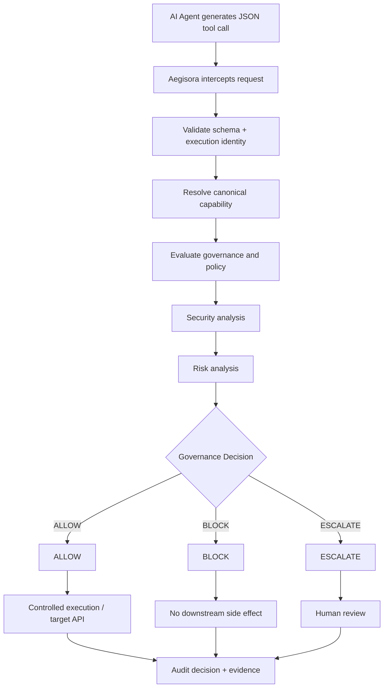
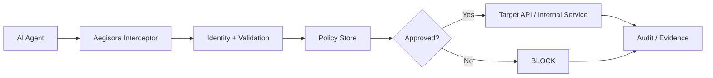

# Aegisora Architecture

> Zero-trust governance infrastructure for AI agents and their tool/API execution paths.

## 1. Mental Model — TL;DR

Giving an autonomous AI agent raw access to internal APIs is a security nightmare.

Aegisora introduces a deterministic, zero-trust execution boundary between AI agents and protected tools, providers, APIs, integrations, and other side effects.

The mental model is:

```text
AI Agent
   |
   v
Execution Intent
   |
   v
Aegisora Governance Boundary
   |
   +--> Identity / Access
   +--> Policy Evaluation
   +--> Security Analysis
   +--> Risk Analysis
   +--> Decision
   |
   +---- ALLOW ----> Controlled execution
   |
   +---- BLOCK ----> No side effect
   |
   +---- ESCALATE -> Human review
```

The key invariant is:

> No governed capability crosses the execution boundary before the canonical enforcement path has produced an explicit decision.

---

## 2. System Architecture & Data Flow

### Tool-call lifecycle



### Policy-backed proxy model



A production deployment may use PostgreSQL or another durable policy/data store. Policy state must remain authoritative before protected side effects occur.

---

## 3. Component Breakdown

### `/core`

Infrastructure and runtime domain.

Contains runtime execution, agent identity, lifecycle, permissions, enforcement, providers, policy, security, audit, observability, plugins, storage, SDK packages, and supporting infrastructure.

### `/website`

User-facing and developer-facing frontend.

Contains Next.js, React components, public assets, styling, frontend utilities, and frontend build configuration.

The website must not become the security authority for protected execution.

### `/docs`

Architecture and contributor documentation.

---

## 4. Core Security Invariants

### Identity authenticity

An `agentId` string is not proof of identity. Protected execution must resolve the identity through the canonical runtime registry.

### Capability authority

Runtime-owned capabilities must have one canonical authority.

### Enforcement before side effects

```text
Request
  |
  v
EnforcementGate
  |
  +--> BLOCK      -> stop
  +--> ESCALATE   -> stop / review
  +--> ALLOW      -> protected execution
```

### Canonical provider and model identity

Provider and model identity must come from the canonical request/runtime path rather than untrusted metadata.

### Auditability

Governance decisions should preserve identity, capability, decision, reason, risk information, correlation identifiers, timestamps, and relevant execution metadata.

---

## 5. Contributor Guidance

1. Preserve the canonical identity authority.
2. Preserve enforcement before side effects.
3. Avoid duplicated capability registries.
4. Do not allow caller-controlled metadata to redefine security-sensitive identity.
5. Add adversarial or boundary tests for new execution surfaces.
6. Preserve audit evidence for ALLOW, BLOCK, and ESCALATE.

---

## 6. Current Engineering Bottlenecks

One open architectural question is whether the highest-throughput network routing layer should eventually be decoupled into a dedicated **Go-based microservice**, while policy management and governance semantics remain in the existing control-plane implementation.

The benefit would be high-throughput routing and a clearer data-plane/control-plane separation.

THe trade-off is additional operational complexity and the requirement to preserve identity, policy propagation, and audit correlation across the service boundary.

This remains an open engineering decision rather than a finalized architecture.

---

## 7. Design Principle

> **Agents produce intent. Aegisora decides whether that intent is allowed to become a side effect.**
