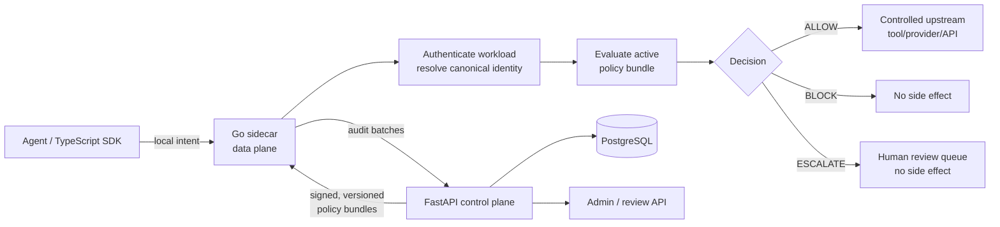

# Go Sidecar and FastAPI Control Plane

## Purpose

This document explains the architecture that exists in this repository and turns the open Go-service question in [`docs/ARCHITECTURE.md`](../ARCHITECTURE.md) into a concrete proposal.

It is a target-architecture proposal, not a description of already implemented production behavior. The repository now contains the first Go decision-sidecar vertical slice under `services/sidecar`; it does not yet contain the controlled upstream proxy or a durable FastAPI control plane.

## The Architecture in Plain Language

Aegisora is intended to sit between an AI agent and anything on which that agent can cause a side effect: a tool, model provider, API, database, shell, or another agent.

The agent supplies an **execution intent**: “I want to perform this action with these arguments.” Aegisora treats that intent as untrusted. It resolves the real identity and capability, evaluates policy and risk, and produces one of three outcomes:

- `ALLOW`: the governed action may proceed through the controlled path.
- `BLOCK`: the action must stop and no downstream side effect may occur.
- `ESCALATE`: the action must stop until an authorized human-review workflow explicitly approves it.

This is what “zero-trust runtime governance” means in this repository. It does not mean that every request is rejected. It means no identity, capability, or request is implicitly trusted, and no governed action is executed without an explicit decision.

The most important rule is therefore:

> Enforcement must happen before the side effect, on a path the caller cannot bypass.

Logging a decision after a tool has run, or returning a decision that the caller is free to ignore, does not provide this security boundary.

## What Exists Today

The repository currently contains four major areas:

### Go decision sidecar

`services/sidecar` implements the shared `v1alpha1` execution-intent and decision contracts with Go 1.27. It strictly validates requests, verifies and atomically activates Ed25519-signed policy bundles, evaluates deterministic deny-overrides rules, records correlated decisions in a bounded audit sink, and exposes policy-backed readiness.

This is currently a decision service, not yet the complete hard enforcement boundary: it does not proxy approved upstream requests, authenticate the local workload transport, poll the FastAPI control plane, or durably export audit evidence.

### TypeScript runtime and SDK

The pnpm workspace under `core/packages` is the main implementation. Its packages separate shared contracts, runtime orchestration, policy, security, audit, observability, storage, plugins, and the public SDK.

Within `@aegisora/runtime`, `AgentRuntime` owns the canonical runtime objects: the agent registry, tool registry, permission engine, enforcement gate, provider gateway, lifecycle, and evidence stores. Tool and provider calls are designed to pass through `EnforcementGate` before execution. Private capability tokens make direct access to the underlying tool/provider execution paths more difficult.

The effective runtime flow is:

```text
SDK / protected agent
        |
        v
TypeScript AgentRuntime
        |
        +--> canonical agent and capability lookup
        +--> permission -> policy -> security -> risk
        +--> ALLOW / BLOCK / ESCALATE
        +--> audit decision
        |
        +--> provider/tool execution only after ALLOW
```

The repository also contains a staged `GovernanceEngine` that expresses the conceptual evaluation pipeline. Aegisora `2.0.0` established `ToolRegistry` as the single canonical tool authority, added scoped single-use authorization receipts, removed legacy runtime authority implementations, and hardened governance and correlation boundaries. Subsequent upstream work adds expiring and revocable delegated-agent capabilities, scope-containment checks, sibling isolation, and collaboration task ownership. The sidecar must preserve those canonical identity, capability, delegation, authorization, ownership, and correlation semantics at the process boundary rather than establish a competing authority.

### Python FastAPI reference interceptor

`core/interceptor.py` is a small, transport-neutral reference interceptor with an in-memory tenant policy store. `core/main.py` exposes it through FastAPI at `POST /intercept`.

It demonstrates a useful initial contract: validate a request, resolve a tenant policy, authorize a tool, and return a correlated decision. However, it is only a prototype:

- it supports `ALLOW` and `BLOCK`, but not `ESCALATE`;
- it trusts a caller-supplied `tenant_id` instead of authenticating a workload;
- policy and decisions are in memory;
- it returns a routing hint but does not enforce the downstream side effect;
- it is currently described as a Python “data plane,” not as a control plane.

The proposal below changes the responsibility of this Python service. FastAPI becomes the management/control plane; the Go sidecar becomes the local, high-throughput enforcement/data plane.

### Next.js website and documentation

`website` is the public UI. It is not, and must not become, an authority for runtime identity or policy decisions. `docs` records the target architecture, security invariants, and architectural decisions.

## Why Split the System?

A control plane and a data plane optimize for different work.

| Plane | Primary job | Desired properties |
| --- | --- | --- |
| FastAPI control plane | Manage identities, policies, policy versions, reviews, and audit records | Expressive domain logic, safe administration, durable storage |
| Go sidecar data plane | Intercept and enforce every governed action close to the workload | Low latency, bounded resource use, easy deployment, fail-closed behavior |

The split removes policy administration and database work from the hot request path. It also allows each agent workload to talk to a local enforcement process instead of making every action depend on a remote management API.

The split is useful only if it preserves one logical authority:

- the control plane is authoritative for **desired policy and identity state**;
- a sidecar is authoritative for **enforcing the last valid policy snapshot for its workload**;
- the agent, SDK, website, and request metadata are never security authorities.

## Proposed Target Architecture



### Go sidecar responsibilities

The Go service is the policy-enforcement point next to the governed workload. It should:

1. Listen on a Unix domain socket by default, with loopback TCP as an explicit alternative.
2. Authenticate the calling workload and derive tenant and agent identity from credentials or sidecar configuration. A payload field alone is never proof of identity.
3. Validate size, shape, content type, deadlines, and canonical capability names before evaluating a request.
4. Atomically load a signed, versioned policy bundle obtained from the control plane.
5. Evaluate deterministic permission, policy, security, and risk rules locally.
6. Apply deny-overrides precedence and return exactly one of `ALLOW`, `BLOCK`, or `ESCALATE`.
7. Prevent the side effect on `BLOCK` and `ESCALATE`.
8. On `ALLOW`, either proxy the request to an allowlisted upstream or issue a short-lived, request-bound authorization token to an enforcement-aware gateway. Proxy mode is the preferred hard boundary.
9. Write a correlated decision record to a local bounded write-ahead buffer and deliver audit events to the control plane in batches.
10. Expose liveness, readiness, metrics, and build/policy version information.

The sidecar must not expose policy administration, accept arbitrary upstream URLs, silently downgrade policy versions, or call a protected upstream before the decision is final.

### FastAPI control-plane responsibilities

The FastAPI service owns management and governance state. It should:

1. Authenticate operators and sidecars separately and enforce tenant-scoped authorization.
2. Manage tenants, workload/agent identities, capabilities, routes, and policy documents.
3. Validate and compile policy documents into a normalized, immutable policy bundle understood by Go.
4. Version, hash, sign, publish, and revoke bundles.
5. Register sidecars and serve bundle updates through polling initially; a streaming transport can be added later without changing policy semantics.
6. Accept idempotent audit-event batches and persist/query decision evidence.
7. Create and resolve human-review requests for `ESCALATE` decisions.
8. Issue a short-lived, single-use approval token bound to the original intent digest, identity, capability, and policy version when a review is approved.
9. Store authoritative data in PostgreSQL. Redis may be used for disposable caching or queues, but not as the only policy authority.

The control plane should provide a reference evaluator for conformance tests, but it should not be on the normal per-request hot path. A rule that requires a remote check must declare that dependency explicitly and fail closed or escalate when the check is unavailable.

### TypeScript runtime and SDK responsibilities

The existing TypeScript packages remain useful as the developer integration and agent-lifecycle layer. They should:

- turn tool/provider actions into the shared execution-intent contract;
- call the local Go sidecar for governed execution;
- preserve request and correlation identifiers;
- never fall back to an ungoverned direct provider/tool call when the sidecar is unavailable;
- retain public SDK ergonomics while removing duplicated enforcement authority.

During migration, the current in-process enforcement gate can act as a compatibility adapter and a conformance oracle. In the final distributed mode, policy decisions must not be independently made by both TypeScript and Go with different policy state.

## Contracts Between the Planes

The first version should use an OpenAPI-defined JSON/HTTP contract. FastAPI can publish the schema, while generated Go and TypeScript models prevent field drift. gRPC or streaming bundle delivery can be introduced later if profiling shows a need.

### Execution intent

An intent should contain at least:

```json
{
  "request_id": "caller-idempotency-key",
  "correlation_id": "trace-id",
  "agent_claim": "agent:123",
  "capability_request": {
    "capability": "provider.generate",
    "provider": "openai",
    "model": "gpt-test",
    "route": "/v1/chat/completions"
  },
  "input": {},
  "context": {}
}
```

`tenant_id`, trusted agent identity, provider identity, model identity, and route must be derived or checked against authenticated/canonical state. They must not be redefined by arbitrary `context` or `input` metadata.

### Decision envelope

A decision should contain at least:

```json
{
  "decision_id": "generated-id",
  "request_id": "caller-idempotency-key",
  "correlation_id": "trace-id",
  "decision": "ALLOW",
  "allowed": true,
  "reason_code": "POLICY_ALLOW",
  "risk": {
    "score": 10,
    "level": "LOW",
    "signals": []
  },
  "policy_version": "42",
  "policy_digest": "sha256:...",
  "evaluated_at": "2026-08-26T12:00:00Z"
}
```

Stable reason codes are part of the API; prose is for people. A duplicated `allowed` boolean should either be omitted or mechanically derived from `decision`, because contradictory fields create unsafe client behavior.

### Policy bundle

A bundle should be immutable and include:

- schema and evaluator versions;
- tenant/workload scope;
- monotonically increasing policy version;
- issued-at and expiry timestamps;
- canonical capability and route allowlists;
- normalized rules and risk thresholds;
- bundle digest, key identifier, and signature.

The sidecar verifies scope, signature, version compatibility, expiry, and digest before atomically activating a bundle. Python and Go must share a corpus of golden inputs and expected decisions so that the compiler and evaluator cannot drift unnoticed.

## Request and State Flows

### Normal request

1. The SDK sends an intent to its local sidecar.
2. The sidecar authenticates the workload and resolves canonical identity.
3. It validates the intent and resolves the canonical capability and route.
4. It evaluates the current bundle.
5. It creates and buffers an audit decision.
6. On `ALLOW`, it invokes the configured upstream through the controlled path.
7. On `BLOCK`, it returns a denial without calling upstream.
8. On `ESCALATE`, it creates/reports a review request and returns without calling upstream.

### Policy publication

1. An authorized operator creates or updates a policy in FastAPI.
2. The control plane validates and compiles it in a database transaction.
3. It stores an immutable version, signs it, and marks it published.
4. The sidecar fetches the update using mTLS and an `ETag`/current-version cursor.
5. The sidecar validates the bundle and swaps it atomically; in-flight requests continue using the version with which they started.

### Human review

1. The sidecar returns `ESCALATE` and records the intent digest.
2. FastAPI persists a pending review scoped to the tenant and authorized reviewers.
3. Approval produces a short-lived, single-use token bound to the original request and policy version.
4. The request is resubmitted through the sidecar. The sidecar validates the token and rechecks non-overridable safety rules before execution.

Approval is not a direct call to the upstream and never means “skip the sidecar.”

## Failure and Security Semantics

The distributed boundary must have explicit behavior:

| Condition | Required behavior |
| --- | --- |
| No valid policy has ever been loaded | Not ready; block governed execution |
| Control plane unavailable, valid unexpired bundle present | Continue with the last-known-good bundle and emit degraded telemetry |
| Bundle expired or signature/version invalid | Fail closed; never reuse it silently |
| Unknown identity, capability, action, or route | `BLOCK` and audit |
| Policy requires unavailable remote analysis | `BLOCK` or `ESCALATE` according to an explicit rule; never implicit `ALLOW` |
| Audit delivery unavailable | Buffer locally within configured bounds; use fail-closed durability for designated high-impact capabilities |
| Duplicate request ID | Return the same compatible decision or reject a conflicting payload digest |
| Sidecar unavailable | SDK returns an enforcement-unavailable error; no direct-execution fallback |
| Control-plane rollback attempt | Reject versions older than the active version unless a separately authorized rollback protocol is used |

All network communication between sidecar and control plane should use mTLS. Operator endpoints need tenant-aware RBAC. Secrets and raw sensitive tool input should not be logged; audit schemas should support redaction and cryptographic integrity. Upstream destinations must come from signed policy/configuration to avoid turning the sidecar into an SSRF or open-proxy surface.

## Suggested Repository Layout

```text
contracts/
  openapi/
  conformance/
services/
  control-plane/       # FastAPI application, migrations, policy compiler
  sidecar/             # Go daemon, evaluator, proxy, policy cache
core/packages/
  sdk/                 # TypeScript client integration
  runtime/             # agent lifecycle and compatibility adapter
deploy/
  docker-compose.yml   # local control plane, PostgreSQL, sidecar, test upstream
```

The current `core/main.py` and `core/interceptor.py` can seed the control-plane contract, but they should not remain a second production data plane after the Go sidecar is introduced.

## Phased Delivery

### Phase 1: Contract and vertical slice

- Freeze `v1alpha1` intent, decision, error, bundle, audit, and review schemas.
- Scaffold FastAPI and Go services in the proposed directories.
- Add PostgreSQL migrations for tenants, identities, policy versions, and audit events.
- Implement signed bundle publication and sidecar polling.
- Implement local Go evaluation for `ALLOW` and `BLOCK` with a test upstream.
- Add TypeScript sidecar client integration behind an explicit configuration flag.

### Phase 2: Hard enforcement and escalation

- Add proxy mode and strict upstream allowlisting.
- Add `ESCALATE`, review persistence, and replay-safe approval tokens.
- Add local durable audit buffering and idempotent batch ingestion.
- Remove direct-execution fallback from distributed mode.

### Phase 3: Hardening and operations

- Add mTLS identity, operator RBAC, key rotation, revocation, rollback procedure, rate limits, payload limits, and redaction.
- Add conformance, adversarial, outage, replay, stale-policy, and no-side-effect tests.
- Publish latency/throughput benchmarks and service-level objectives.
- Reconcile or retire duplicated TypeScript/Python evaluators.

## Acceptance Criteria for the Architecture Epic

- The boundary and ownership rules above are captured in an accepted ADR.
- One versioned contract generates or validates Python, Go, and TypeScript models.
- FastAPI publishes a signed policy bundle backed by PostgreSQL.
- A Go sidecar validates and atomically activates that bundle.
- An end-to-end test proves `ALLOW` reaches a test upstream and `BLOCK` and `ESCALATE` do not.
- Unknown identities/capabilities and unavailable/expired policy fail closed.
- Every outcome carries request, correlation, decision, and policy identifiers and is persisted idempotently.
- Python and Go pass the same decision-conformance fixtures.
- The TypeScript SDK cannot silently bypass the sidecar in distributed mode.
- Failure-mode and benchmark results are documented.

## Non-goals for the First Vertical Slice

- A general-purpose service mesh or transparent interception of every network protocol.
- A full policy-language invention.
- Multi-region active/active control-plane deployment.
- A production administration UI.
- Arbitrary plugin execution inside the sidecar.

## Proposed GitHub Issue

### Title

`RFC/EPIC: Introduce a Go enforcement sidecar and FastAPI governance control plane`

### Description

## Summary

Introduce a local Go enforcement sidecar as the Aegisora data plane and turn the Python/FastAPI service into the governance control plane.

The Go sidecar will intercept governed agent actions close to the workload, evaluate a signed and versioned policy bundle, and prevent unauthorized side effects. FastAPI will own tenant and identity management, policy lifecycle, bundle publication, human review, and audit ingestion. The existing TypeScript runtime and SDK will remain the developer integration and agent-lifecycle layer, but distributed mode must delegate governed execution to the sidecar without an ungoverned fallback.

## Background

Aegisora sits between an AI agent and anything on which that agent can cause a side effect: a tool, model provider, API, database, shell, or another agent.

The agent supplies an untrusted execution intent. Aegisora must resolve the authentic identity and canonical capability, evaluate permission, policy, security, and risk, and produce exactly one of these decisions:

- `ALLOW`: the governed action may proceed through the controlled path.
- `BLOCK`: execution stops and no downstream side effect occurs.
- `ESCALATE`: execution stops until an authorized review workflow approves it.

The core invariant is:

> No governed capability may cross the execution boundary before the canonical enforcement path has produced an explicit decision.

Returning a decision that the caller is free to ignore is not sufficient. The sidecar must either proxy the allowed operation itself or issue a short-lived, request-bound authorization token that is enforced by the upstream gateway. Proxy mode is the preferred hard boundary.

## Current State

The repository currently has:

- a TypeScript pnpm workspace containing the SDK, agent runtime, canonical agent and tool registries, enforcement gate, permission/policy/security/risk logic, provider gateway, plugins, audit, observability, and storage packages;
- an in-process TypeScript execution path that attempts to enforce policy before tool and provider calls;
- a canonical TypeScript `ToolRegistry` execution authority with scoped single-use authorization receipts and governance-boundary regression traces;
- a small Python interceptor with an in-memory tenant policy store;
- a FastAPI adapter exposing `GET /health` and `POST /intercept`;
- an initial Go decision sidecar with signed local bundle activation, but no controlled upstream proxy, remote policy distribution, durable policy control plane, authenticated workload identity, or persistent human-review workflow.

The Python prototype currently supports only `ALLOW` and `BLOCK`, trusts a caller-provided `tenant_id`, stores policy in memory, and does not enforce the downstream call. It is useful as a contract prototype but must not remain a second production data plane after the Go sidecar is introduced.

The staged TypeScript governance model, canonical runtime execution authority, Python prototype, and Go policy evaluator operate at different layers. Their shared contract and security semantics must stay aligned so that moving enforcement to the sidecar does not introduce a second logical authority with different identity, capability, decision, or correlation state.

## Proposed Architecture

```text
Agent / TypeScript SDK
          |
          | local execution intent
          v
+-----------------------------------+
| Go sidecar — data plane           |
|                                   |
| authenticate workload             |
| resolve identity and capability   |
| validate request                  |
| evaluate active policy bundle     |
| ALLOW / BLOCK / ESCALATE          |
| buffer audit evidence             |
+-----------------+-----------------+
                  |
        ALLOW     |       BLOCK / ESCALATE
                  |               |
                  v               v
       controlled upstream    no side effect
       tool/provider/API      review if required

FastAPI control plane
          |
          +--> PostgreSQL authoritative state
          +--> tenant and workload identity management
          +--> policy validation, compilation, versioning, signing
          +--> sidecar registration and policy-bundle delivery
          +--> human-review workflow
          +--> audit ingestion and queries
```

The ownership model is:

- FastAPI is authoritative for desired identity and policy state.
- PostgreSQL is the durable system of record.
- The Go sidecar is authoritative for enforcing the last valid policy snapshot for its workload.
- The SDK, website, request body, and arbitrary metadata are not security authorities.
- Redis may be used for disposable caching or queues, but not as the only policy authority.

The control plane should not be on the normal per-request hot path. The sidecar evaluates deterministic compiled rules locally. A policy rule that requires a remote check must declare that dependency explicitly and must `BLOCK` or `ESCALATE`, never implicitly allow, when the check is unavailable.

## Go Sidecar Responsibilities

The sidecar is the local policy-enforcement point. It must:

1. Listen on a Unix domain socket by default, with loopback TCP as an explicit alternative.
2. Authenticate the calling workload and derive tenant and agent identity from workload credentials or pinned sidecar configuration.
3. Treat payload identity fields as claims to verify, never as proof of identity.
4. Enforce request-size, content-type, schema, deadline, and concurrency limits.
5. Resolve canonical capability, action, provider/model identity, and upstream route without allowing arbitrary metadata to override them.
6. Fetch, validate, and atomically activate signed, immutable policy bundles.
7. Evaluate permission, policy, security, and risk locally with deny-overrides precedence.
8. Produce exactly one of `ALLOW`, `BLOCK`, or `ESCALATE` with stable reason codes and policy-version evidence.
9. Prevent downstream execution for `BLOCK` and `ESCALATE`.
10. On `ALLOW`, proxy to a policy-allowlisted upstream or issue a short-lived, request-bound authorization token to an enforcement-aware gateway.
11. Reject arbitrary upstream URLs so that it cannot become an SSRF or open proxy surface.
12. Append a correlated decision to a bounded local write-ahead buffer and send audit events to FastAPI in idempotent batches.
13. Expose liveness, readiness, metrics, build version, and active policy version.
14. Never expose policy-administration endpoints or silently downgrade policy.

## FastAPI Control-Plane Responsibilities

The control plane must:

1. Authenticate operators and sidecars separately.
2. Apply tenant-scoped RBAC to all management and review operations.
3. Manage tenants, workload/agent identities, capabilities, policy documents, routes, and sidecar registrations.
4. Validate policy documents and compile them into a normalized representation understood by the Go evaluator.
5. Store immutable policy versions in PostgreSQL.
6. Hash, sign, publish, revoke, and intentionally roll back policy bundles.
7. Deliver current bundles through authenticated polling with `ETag` or version cursors initially. Streaming delivery can be added later without changing policy semantics.
8. Accept idempotent audit-event batches and provide tenant-scoped evidence queries.
9. Persist `ESCALATE` review requests and authorize reviewer decisions.
10. On approval, issue a short-lived, single-use token bound to the original intent digest, identity, capability, policy version, and expiry.
11. Provide a reference evaluator for conformance tests without placing FastAPI in the ordinary action hot path.
12. Support signing-key rotation, revocation, redaction rules, and audit integrity.

## TypeScript Runtime and SDK Responsibilities

The TypeScript packages must:

- preserve the existing developer-facing SDK where practical;
- convert tool and provider operations into the shared execution-intent contract;
- send governed operations to the local sidecar;
- propagate request and correlation identifiers;
- surface `BLOCK`, `ESCALATE`, and enforcement-unavailable results clearly;
- never fall back to an ungoverned direct tool/provider call when the sidecar is unavailable;
- avoid independently evaluating a different policy version in distributed mode;
- retain agent lifecycle, planning, provider adapters, and compatibility logic that do not conflict with the sidecar’s enforcement authority.

The existing in-process enforcement gate may temporarily act as a compatibility adapter and conformance oracle during migration. It must not remain a competing production policy authority.

## Versioned Contracts

Define one OpenAPI `v1alpha1` contract and generate or validate models for Python, Go, and TypeScript. Begin with JSON/HTTP. gRPC or streaming may be added later only if profiling demonstrates the need.

### Execution intent

```json
{
  "request_id": "caller-idempotency-key",
  "correlation_id": "trace-id",
  "agent_claim": "agent:123",
  "capability_request": {
    "capability": "provider.generate",
    "provider": "openai",
    "model": "gpt-test",
    "route": "/v1/chat/completions"
  },
  "input": {},
  "context": {}
}
```

Tenant, trusted agent identity, canonical provider/model identity, and upstream route must be derived from or checked against authenticated state. An `input` or `context` field may not redefine them.

### Decision envelope

```json
{
  "decision_id": "generated-id",
  "request_id": "caller-idempotency-key",
  "correlation_id": "trace-id",
  "decision": "ALLOW",
  "allowed": true,
  "reason_code": "POLICY_ALLOW",
  "risk": {
    "score": 10,
    "level": "LOW",
    "signals": []
  },
  "policy_version": "42",
  "policy_digest": "sha256:...",
  "evaluated_at": "2026-08-26T12:00:00Z"
}
```

Reason codes are stable API values; messages are explanatory. Do not maintain an independently writable `allowed` boolean because it can contradict `decision`. If compatibility requires it, derive it mechanically as `decision == ALLOW`.

### Policy bundle

Each bundle must be immutable and contain:

- schema and evaluator versions;
- tenant/workload scope;
- monotonically increasing policy version;
- issue and expiry timestamps;
- canonical capability and route allowlists;
- normalized rules and risk thresholds;
- digest, signing-key identifier, and signature.

The sidecar verifies scope, signature, supported versions, digest, expiry, and rollback status before atomically activating a bundle. In-flight requests keep the policy version with which they began.

Python and Go must share golden execution intents and expected decisions. CI must fail if the control-plane reference evaluator and Go evaluator disagree.

## Required API Surfaces

Exact paths may be adjusted while freezing OpenAPI, but the first contract must cover:

### Sidecar-local API

- health, readiness, and version endpoints;
- submit an execution intent and receive its decision;
- preferred proxy/execute operation for allowlisted upstreams;
- approval-token resubmission for reviewed intents.

### Control-plane sidecar API

- register/authenticate a sidecar;
- fetch the current policy bundle conditionally by version or `ETag`;
- ingest idempotent audit batches;
- create or update escalation-review state;
- expose signing-key and revocation information securely.

### Control-plane operator API

- tenant, identity, capability, route, and policy management;
- policy validation, publication, revocation, and authorized rollback;
- pending-review queries and approve/deny actions;
- audit/evidence queries scoped by tenant and operator role.

## Runtime Flows

### Normal request

1. The SDK sends an intent to its local sidecar.
2. The sidecar authenticates the workload and resolves canonical identity.
3. It validates the intent and resolves the canonical capability and route.
4. It evaluates the active bundle.
5. It creates and buffers a correlated audit decision.
6. On `ALLOW`, it invokes the upstream through the controlled path.
7. On `BLOCK`, it returns a denial without calling upstream.
8. On `ESCALATE`, it creates or reports a review request and returns without calling upstream.

### Policy publication

1. An authorized operator submits a policy change to FastAPI.
2. The control plane validates and compiles it in a database transaction.
3. It stores an immutable version, signs it, and marks it published.
4. An authenticated sidecar fetches the update using a version cursor or conditional request.
5. The sidecar validates and atomically activates the bundle.
6. Audit and readiness telemetry report the active version.

### Human review

1. The sidecar returns `ESCALATE` and records the intent digest.
2. FastAPI persists a pending review scoped to the tenant and eligible reviewers.
3. A reviewer approves or denies it through an authenticated operator API.
4. Approval creates a short-lived, single-use token bound to the original request, identity, capability, intent digest, and policy version.
5. The request is resubmitted through the sidecar.
6. The sidecar validates the token and rechecks non-overridable safety rules before allowing execution.

Approval never directly calls the upstream and never bypasses the sidecar.

## Failure Semantics

| Condition | Required behavior |
| --- | --- |
| No valid policy has ever been loaded | Sidecar is not ready and blocks governed execution |
| Control plane unavailable with an unexpired bundle | Continue using the last-known-good bundle and emit degraded telemetry |
| Bundle expired, malformed, incompatible, or unsigned | Fail closed |
| Unknown identity, capability, action, provider, or route | `BLOCK` and audit |
| Required remote analysis unavailable | Explicitly `BLOCK` or `ESCALATE`; never implicit `ALLOW` |
| Audit delivery temporarily unavailable | Buffer locally within configured bounds |
| Required audit durability unavailable for a high-impact capability | Fail closed according to policy |
| Duplicate request ID with the same payload digest | Return the compatible idempotent result |
| Duplicate request ID with a different payload digest | Reject and audit the conflict |
| Sidecar unavailable | SDK returns enforcement unavailable; no direct fallback |
| Older policy received unexpectedly | Reject unless an authenticated rollback protocol authorizes it |

Timeout and cancellation behavior must guarantee that an ambiguous client response cannot cause an untracked retry or duplicate side effect. Proxy operations need idempotency semantics appropriate to their upstream.

## Security Requirements

- Use mTLS between sidecars and the control plane.
- Protect the Unix socket with filesystem permissions; secure loopback mode separately.
- Authenticate operators independently from workloads and apply tenant-aware RBAC.
- Never use a caller-provided `tenant_id` or `agent_id` as identity proof.
- Strip or reject metadata that conflicts with canonical identity, capability, provider, model, policy, or route fields.
- Source upstream destinations from signed policy/configuration.
- Redact secrets and sensitive tool input from logs and audit events.
- Sign policy bundles and support signing-key rotation and revocation.
- Protect approval tokens from replay and bind them to one intent and expiry.
- Apply payload, concurrency, rate, decompression, and deadline limits.
- Preserve correlation and policy-version evidence for all three decisions.
- Add adversarial tests proving `BLOCK` and `ESCALATE` never reach upstream.

## Suggested Repository Layout

```text
contracts/
  openapi/
  conformance/
services/
  control-plane/       # FastAPI, migrations, policy compiler and management API
  sidecar/             # Go daemon, evaluator, proxy and policy cache
core/packages/
  sdk/                 # TypeScript sidecar client integration
  runtime/             # agent lifecycle and migration adapter
deploy/
  docker-compose.yml   # PostgreSQL, control plane, sidecar and test upstream
```

## Delivery Plan

### Phase 1: Contract and vertical slice

- Freeze OpenAPI schemas for intent, decision, errors, policy bundle, audit batch, and review records.
- Add cross-language conformance fixtures.
- Scaffold the FastAPI control plane and Go sidecar.
- Add PostgreSQL migrations for tenants, identities, policy versions, sidecar registrations, and audit events.
- Implement policy validation, immutable versions, signing, publication, and sidecar polling.
- Implement atomic bundle activation and local Go `ALLOW`/`BLOCK` evaluation.
- Add a controlled test upstream.
- Add a TypeScript sidecar client behind explicit distributed-mode configuration.
- Prove that an allowed test request reaches upstream and a blocked request does not.

### Phase 2: Hard enforcement and escalation

- Add sidecar proxy mode with strict route allowlisting.
- Implement `ESCALATE` and persistent human review.
- Implement request-bound, expiring, single-use approval tokens.
- Add local durable audit buffering and idempotent batch ingestion.
- Define proxy retry and idempotency behavior.
- Remove any direct-execution fallback from distributed mode.

### Phase 3: Security and operational hardening

- Add sidecar/control-plane mTLS and operator RBAC.
- Add signing-key rotation, revocation, and authorized rollback procedures.
- Add rate, payload, deadline, and concurrency controls.
- Add redaction and audit-integrity controls.
- Add stale-policy, outage, replay, conflicting-idempotency-key, and no-side-effect adversarial tests.
- Add metrics, traces, dashboards, and operational runbooks.
- Publish latency and throughput benchmarks plus initial service-level objectives.
- Reconcile or retire duplicated TypeScript and Python evaluators.

## Acceptance Criteria

- [ ] The data-plane/control-plane ownership model is explicit in code and deployment configuration.
- [ ] One versioned OpenAPI contract generates or validates Python, Go, and TypeScript models.
- [ ] PostgreSQL stores tenants, authenticated workload identities, immutable policy versions, reviews, and audit evidence.
- [ ] FastAPI validates, signs, publishes, revokes, and serves policy bundles.
- [ ] The Go sidecar verifies and atomically activates a scoped policy bundle.
- [ ] The sidecar returns `ALLOW`, `BLOCK`, and `ESCALATE` with stable reason, correlation, and policy identifiers.
- [ ] An end-to-end test proves only `ALLOW` reaches a test upstream.
- [ ] Unknown identities, capabilities, actions, and routes fail closed.
- [ ] Missing, expired, invalid, incompatible, or unexpectedly rolled-back policy fails closed.
- [ ] Control-plane outage behavior with a last-known-good bundle is tested.
- [ ] Audit delivery is idempotent and tolerates a temporary control-plane outage without losing buffered decisions within configured limits.
- [ ] Approved escalations use replay-resistant tokens and pass back through the sidecar.
- [ ] Python and Go pass the same golden decision fixtures.
- [ ] The TypeScript SDK cannot silently bypass the sidecar in distributed mode.
- [ ] mTLS, operator RBAC, signing-key lifecycle, redaction, and upstream allowlisting are covered by tests or documented operational validation.
- [ ] Benchmark results and failure-mode behavior are documented.

## Non-goals for the Initial Vertical Slice

- Building a general-purpose service mesh.
- Transparently intercepting every network protocol.
- Inventing a full general-purpose policy language.
- Multi-region active/active control-plane deployment.
- Building a production administration UI.
- Running arbitrary plugins inside the sidecar.
